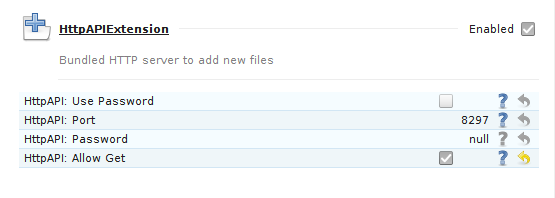

# JDHttpAPI
JDownloader2 plugin with a local HTTP API to add new files for download

This plugin is loaded by JDownloader2, which then starts up an embedded Jetty
HTTP server to receive 

From there, just about anything can send requests to queue up a new link. I
like to use [Tampermonkey userscripts](https://tampermonkey.net/) to scrape
links directly from web pages as I browse.

Note: it binds to your IP address, therefore other PCs on the network can add
links. Configure a password or update the code to bind to something else - 
there is not currently a way configure local-only access. This plugin also
accepts all Origins over ajax.

## Install

1. Close JDownloader.
2. Build or [download](https://github.com/nemec/JDHttpAPI/releases) the `JDHttpApi.jar` file.
3. Place that file in `./extensions/` inside the JDownloader2 program folder.
3. Open the file `./tmp/extensioncache/extensionInfos.json` in your JD program
    folder and insert the following JSON as a new element in the array:
    
```
{
  "settings" : true,
  "configInterface" : "org.jdownloader.extensions.httpAPI.HttpAPIConfig",
  "quickToggle" : false,
  "headlessRunnable" : true,
  "description" : "Http API.",
  "lng" : "en_US",
  "iconPath" : "folder_add",
  "linuxRunnable" : true,
  "macRunnable" : true,
  "name" : "HTTP API",
  "version" : -1,
  "windowsRunnable" : true,
  "classname" : "org.jdownloader.extensions.httpAPI.HttpAPIExtension",
  "jarPath" : "/absolute/path/to/jd2/extensions/JDHttpApi.jar"
}
```

4. Open the file `./update/versioninfo/JD/extensions.installed.json` inside the
    JD program folder and insert the string `"jdhttpapi"` as the last element
    in the JSON array.
5. Start JDownloader2 and go to the settings page to enable the extension.

Note: there is no official extension install process, so most of this is
tricking JD into thinking the JAR is already installed. It's possible that
an update will trigger a cache invalidation that boots out this extension. Just
reapply the steps above and you should get it back.

## Configure

This plugin has four settings to configure through the JDownloader GUI. In order
to make changes take effect, disable and then re-enable the extension.

1. Use a password: require password authentication.
2. Port: the port that the HTTP server listens on. Defaults to 8297.
3. Password: If you've enabled the password feature, set it here.
4. Allow Get: This disables HTTP GET access to the API. When enabled, you
    must POST new links as JSON. This can help you reduce exposure to CSRF
    vulnerabilities, especially when combined with a password.



## Use

There is currently only one URL: `/addLink`. You may submit via POST or GET.

### GET Service

There are three parameters, only `url` is required:

* `url`: The URL to add.
* `packageName`: If you want to configure a custom package name, send it here.
* `forcePackageName`: Set this to `true` to set the package name. For whatever
    reason, this is a separate field in JD's internals but if you don't force
    it, the package name will not be changed. It's possible I am hooking in too
    late in the process.

The response has three possible values:

On success: `{"success":true}`
On malformed input: `{"errorMessage":"some error message"}`
On authentication failure: `Login to access API` (this is not JSON)
    
CURL Examples:

```
curl 'http://localhost:8297/addLink?url=https://i.imgur.com/muChjiN.jpg'
curl 'http://localhost:8297/addLink?url=https://i.imgur.com/muChjiN.jpg&packageName=cutebunny&forcePackageName=true'
```

### POST Service

Send a JSON object via POST with the same values as in the GET request:

```
curl -X POST 'http://localhost:8297/addLink' \
     -d '{"url":"https://i.imgur.com/muChjiN.jpg"}'
curl -X POST 'http://localhost:8297/addLink' \
     -d '{"url":"https://i.imgur.com/muChjiN.jpg","packageName":"cutebunny","forcePackageName":true}'
```

### Authentication

If you choose to use a password, send it as the password portion of HTTP Basic
Authentication - leave the username blank.

CURL Example:

```
curl -u ':mypassword' 'http://192.168.1.7:8297/addLink?url=https://i.imgur.com/muChjiN.jpg'
curl -u ':mypassword' -X POST 'http://localhost:8297/addLink' \
     -d '{"url":"https://i.imgur.com/muChjiN.jpg"}'
```

## Errata

JDownloader2's extension system is surprisingly
modular and easy to understand (aside from the install process). Feel free to
use this project as an example for building other JD extensions as even the
built-in ones are a bit more complex than this. Just make sure to have
[the source code](https://svn.jdownloader.org/projects/jd) open up in
another window for reference - there is virtually no documentation available
and this project only uses the bare minimum of features.


